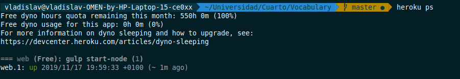

# Despliegue del microservicio en un *PaaS*

## *PaaS* elegido: Heroku

El *PaaS* en el que se va a realizar el despliegue es [Heroku](https://www.heroku.com/).
Se ha elegido esta plataforma debido a la senciellz de uso y a lo rápido que es configurar
la infraestructura para poder desplegar nuestro microservicio. Además de eso, sigue un modelo
*freemium*, por lo tanto, dentro de las operaciones que va a realizar nuestro microservicio
y de lo que va a necesitar para funcionar, no vamos a tener que pagar nada.

## Primeros pasos en Heroku: instalando el *CLI*

Lo primero que tenemos que hacer es instalar el *CLI* de Heroku para poder trabajar desde nuestra
terminal de forma cómoda.

El *CLI* de Heroku puede ser instalado mediante `snap`. Esto viene instalado en las distribuciones
de Ubuntu modernas (a partir de Ubuntu 16.04). En mi caso, he tenido que instalarlo, debido a que
uso Linux Mint 19.1. Una vez teniendo `snap` instalado, basta con ejecutar la siguiente orden para
instalar el *CLI*:

```bash
sudo snap install heroku --classic
```

Con el *CLI* ya instalado, tenemos que asociar nuestra cuenta de Heroku al *CLI*. Para ello, ejecutamos
la siguiente orden desde cualquier directorio (no hace falta que estemos dentro del directorio que contiene
el proyecto):

```bash
heroku login
```

Esto abrirá una ventana en el navegador donde nos tendremos que identificar, como se puede ver a continuación.


## Creando nuestra aplicación en Heroku

Una vez identificados, ya podemos empezar a crear nuestra aplicación en Heroku. Situándonos en el nivel raíz
del directorio donde se encuentra nuestro proyecto, ejecutamos la siguiente orden:

```bash
heroku apps:create --region eu vocabulary-vi
```

De esta forma, le indicamos a Heroku que queremos crear una aplicación en la región de Europa, y le damos el nombre
de `vocabulary-vi` (vocabulary ya estaba cogido; el `vi` del final viene de *virtual infrastructure*, a modo
de curiosidad).

Ahora, tenemos que crear un archivo llamado `Procfile`, el cuál tiene el
[siguiente formato](https://devcenter.heroku.com/articles/procfile#procfile-format). En este
archivo se especificará qué comandos deben ejecutarse cuando se realice un proceso
determinado. A nosotros nos interesa especificar qué se tiene que ejecutar cuando se lanza
nuestro servidor (nuestra aplicación, en otras palabras). Para ello, y para usar
`gulp` para arrancar la aplicación, tenemos que añadir la siguiente línea:

```
web: gulp start-node
```

De esta forma, lanzamos nuestra aplicación sin utilizar PM2, ya que Heroku se encargará
de las tareas de ese calibre, con lo cuál usar PM2 sería redundante.

Sin embargo, para poder utilizar `gulp` con Heroku, nos encontramos con un problema:
el *buildpack* de Node que se utiliza por defecto no lo tiene instalado. En internet
se pueden encontrar *buildpacks* personalizados donde sí que viene instalado, pero
no se ajustan mucho a lo que estamos haciendo.

Para resolver este problema, lo único que ha hecho falta es mover todas aquellas dependencias
de `gulp` en el archivo `package.json`, haciendo que dejen de ser dependencias de desarrollo
para que sean dependencias normales. De esta forma, se podrá instalar `gulp` y todos aquellos
paquetes que necesite y que se necesiten en el `gulpfile.js`. Adicionalmente, se ha ejecutado
la siguiente orden:

```bash
npm install gulp-cli
```

De esta forma, se añade el *CLI* de `gulp` como una dependencia del proyecto, lo cuál permite
ejecutar `gulp` sin tener que instalarlos de forma global. Si se quisiese instalar de forma global,
se tendría que hacer un *fork* del repositorio que contiene el *buildpack* de Node y añadirle
lo necesario para instalar `gulp`.

## Desplegando nuestra aplicación en la nube

```bash
git push heroku master
```


