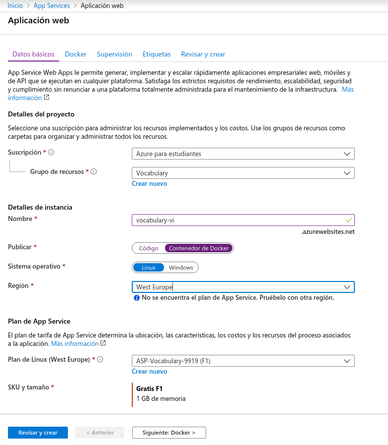
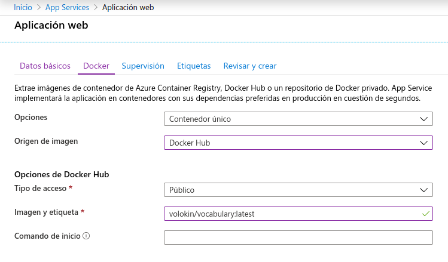

# Despliegue del contenedor de Docker en *PaaS*

## Despliegue en Heroku

El siguiente paso en nuestro proyecto es desplegar la imagen que hemos
creado de Docker en Heroku. El proceso llevado a cabo es bastante sencillo,
tal y como se podrá comprobar a continuación.

Lo primero que tenemos que hacer es crear un archivo llamado `heroku.yml`
en el directorio raíz del proyecto. Este archivo, que puede ser
consultado [aquí](https://github.com/Vol0kin/Vocabulary/blob/master/heroku.yml),
tiene el siguiente contenido:

```yaml
build:
	docker:
		web: Dockerfile
```

De esta forma indicamos que queremos constuir una imagen de Docker, y
que el proceso `web` se iniciará con el comando `CMD` que tenga especificado
el `Dockerfile`. Este comando sustituirá al del `Procfile` que teníamos
definido anteriormente, con lo cuál no hace falta modificar ni eliminar
dicho archivo.

A continuación hay que especificar a la aplicación de Heroku
que hemos creado anteriormente que queremos hacer el despliegue desde
un contenedor. Para ello, hay que modificar el *stack* con el que se
está ejecutando la aplicación. Esto se puede hacer con la siguiente
orden:

```sh
heroku stack:set container
```

Una vez hecho esto, ahora solo nos hace falta realizar el despliegue.
Para ello, como ya tenemos el repositorio de GitHub sincronizado con
Heroku, simplemente basta con ejecutar `git push`. En caso de no
tenerlo, sería necesario ejecutar `git push heroku master`.

## Despliegue en Azure

Como novedad, vamos a realizar el despliegue en un segundo *PaaS*. Lo
haremos en Azure, ya que tiene un plan para estudiantes bastante completo.

Desplegar en Azure utilizando Docker es muy sencillo. Lo primero que
tenemos que hacer es crear una nueva Aplicación Web. En mi caso
lo he hecho de la siguiente forma:



Es importante marcar la opción de *Contenedor de Docker* en el apartado
de **Publicar**, y el sistema operativo correspondiente, ya que vamos
a utilizar una imagen para hacer el despliegue.

Antes de crear la aplicación, procedemos a la sección de Docker. Ahí
podemos especificar el tipo de contenedor que vamos a usar. Azure permite
utilizar una imagen de Docker Hub, con lo cuál solo hace falta especificar
la imagen y su etiqueta correspondiente. Adicionalmente se puede
especificar algún comando extra que se debe hacer para iniciar el servicio,
aunque en nuestro caso no es necesario, ya que con la orden especificada con `CMD`
se inicia la aplicación. Todo lo descrito anteriormente se puede ver
en la siguiente imagen:



Una vez establecida esta configuración para nuestra aplicación web, podemos
proceder a crearla, finalizando como tal el proceso.
