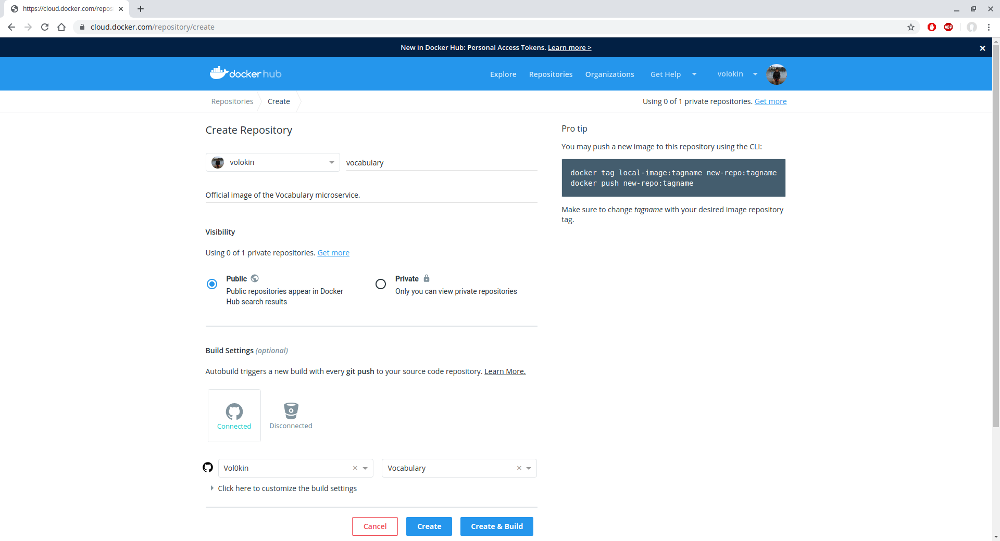
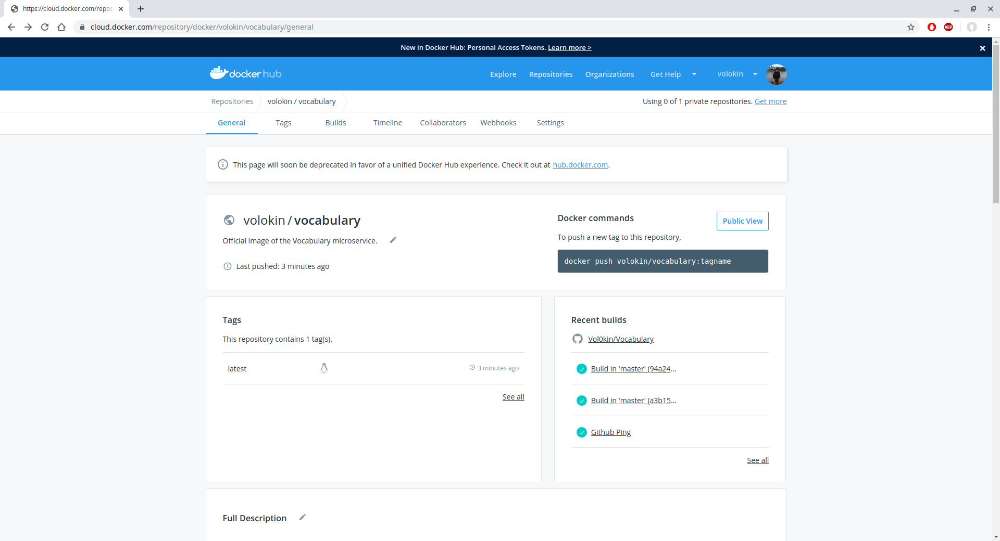

# Publicación de la imagen en Docker Hub

Una vez que tenemos creada nuestra imagen de Docer, podemos subirla a Docker
Hub para que otras personas la puedan utilizar. Todos los pasos se pueden realizar
desde la [página web de Docker Hub](https://hub.docker.com/).

Lo primero que debemos hacer es registrarnos y sincronizar nuestra cuenta de GitHub
con la de Docker Hub. Una vez hecho esto, podemos crear una nueva imagen, tal y
como podemos ver a continuación:



Especificamos que queremos que la imagen sea pública y, si hemos sincronizado
correctamente nuestra cuenta de GitHub con la de Docker Hub, abajo nos aparecerá
una opción para elegir de qué repositorio queremos extraer la imagen. En este caso,
se utilizará el Dockerfile que se encuentre en el repositorio especificado para
construir dicha imagen, y cada vez que hagamos un `git push` se actualizará
dicha imagen. Por tanto, solo tenemos que especificar que queremos que se use
el repositorio en el que tenemos nuestro proyecto.

Una vez hecho esto, seremos redirigidos a la página de nuestra imagen. Aquí aparecerá
el estado de la imagen (si se está construyendo o no), información sobre como descargarla,
etc., tal y como se puede ver a continuación:



En cuanto la *build* esté lista, la imagen se habrá actualizado a su versión
más reciente. Todo este proceso es automático, con lo cuál no tenemos que hacer nada más.

Si queremos descargar y ejecutar la imagen, solo tenemos que hacer lo siguiente:

```bash
docker pull volokin/vocabulary
docker run -p 8080:8080 vocabulary
```