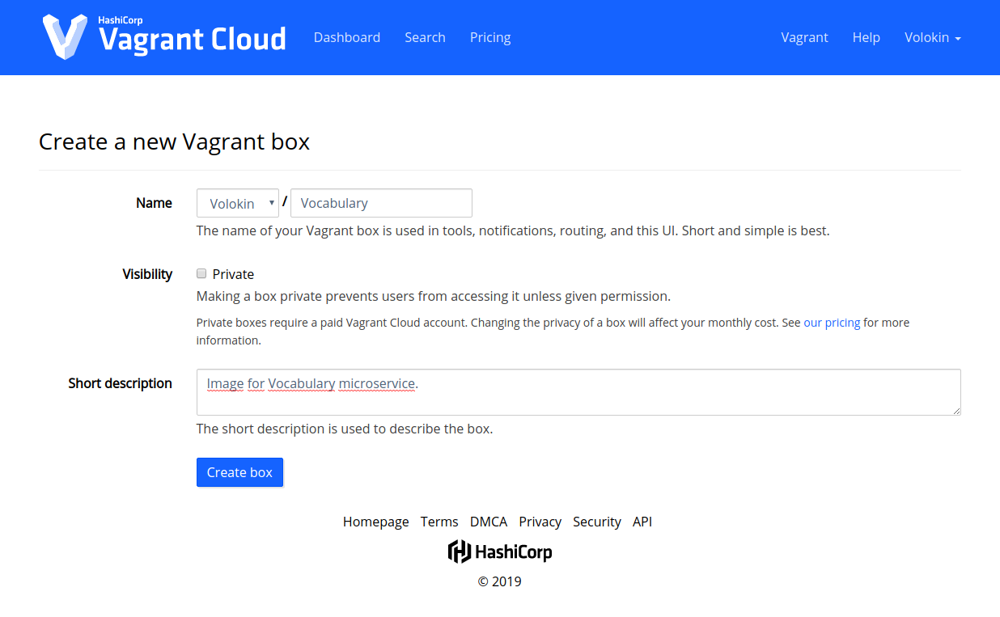
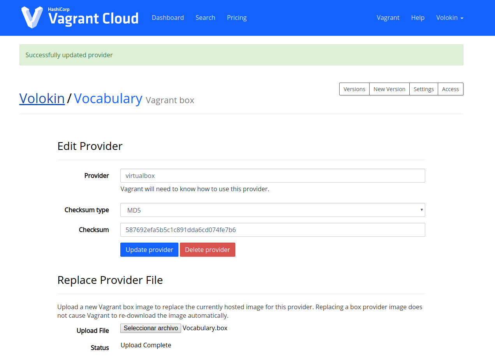

# Creación de una máquina virtual mediante Vagrant

En esta sección vamos a ver cómo podemos crear una máquina virtual la cuál
podremos aprovisionar y donde posteriormente podremos desplegar nuestra
aplicación. Existen muchas herramientas que nos permiten conseguir dicho objetivo.
Una de las más conocidas, y la que utilizaremos en este caso, es
[Vagrant](https://www.vagrantup.com/), la cuál permite crear, provisionar y destruir
máquinas virtuales portables de forma sencilla.

Vamos a ver primero cómo podemos crear una máquina de este tipo, y después vamos
a describir el proceso que se tiene que llevar a cabo si se quiere publicar la
imagen que hemos creado.

## Creación de la máquina virtual

Vagrant permite crear máquinas virtuales de forma sencilla mediante un archivo
`Vagrantfile`, el cuál permite especificar por ejemplo qué recursos queremos que
tenga la máquina, cómo queremos que se exponga, entre otros parámetros. En el proyecto
puede encontrarse un archivo de este tipo [aquí](https://github.com/Vol0kin/Vocabulary/blob/master/Vagrantfile),
el cuál tiene especificada la siguiente configuración:

```ruby
Vagrant.configure("2") do |config|
    config.vm.box = "ubuntu/bionic64"

    config.vm.define "Vocabulary"

    config.vm.network "forwarded_port", guest: 8080, host: 8080, host_ip: "127.0.0.1"

    config.vm.provider "virtualbox" do |vb|
        vb.name = "Vocabulary"
        vb.memory = "1024"
        vb.cpus = 1
    end

    config.vm.provision "ansible" do |ansible|
        ansible.playbook = "provisioning/playbook.yml"
    end
end
```

Para tener una mejor comprensión de lo que se está haciendo, vamos a ir desglosando
lo que se hace poco a poco.

```ruby
Vagrant.configure("2") do |config|
    ...
end
```

Es el bloque principal. Se indica la versión de la configuración con el valor `"2"`
(se recomienda utilizar dicho valor para configuraciones que usen una versión de Vagrant
reciente, aunque también se puede utilizar `"1"`), y se crea un objeto llamado `config`
sobre el que se realizarán el resto de las operaciones.

```ruby
    config.vm.box = "ubuntu/bionic64"
```

Establecemos la máquina virtual que vamos a utilizar, es decir, el sistema operativo que
vamos a utilizar, y el proveedor de éste. En este caso, vamos a utilizar una versión de
**Ubuntu 18.04 Bionic**  de 64 bits mantenida por el equipo de Ubuntu. Se ha escogido esta
imagen debido a que es una versión LTS estable, está bastante mantenida, no es demasiado
pesada y, en general, ofrece un rendimiento bastante bueno.

```ruby
    config.vm.define "Vocabulary"
``` 

Establece el nombre de la máquina de Vagrant. En este caso, la hemos llamado igual que
nuestro servicio, *Vocabulary*.

```ruby
    config.vm.network "forwarded_port", guest: 8080, host: 8080, host_ip: "127.0.0.1"
```

Establece la configuración de la red de la máquina. Aquí se indica que se va a realizar
un mapeo del puerto 8080 del anfitrión (la máquina) al 8080 del anfitrión. Además,
se indica que la dirección IP del anfitrión mediante la cuál se permitirá el acceso
mediante este puerto es la `127.0.0.1`. De esta forma, la máquina podrá ser accedida
desde `localhost` u otras máquinas en la misma red.

```ruby
    config.vm.provider "virtualbox" do |vb|
        vb.name = "Vocabulary"
        vb.memory = "1024"
        vb.cpus = 1
    end
```

Crea un objeto `vb`, el cuál servirá para configurar una serie de parámetros
del proveedor de virtualización, que en este caso es **VirtualBox**. Se establece
que el nombre de la máquina de VirtualBox será *Vocabulary*. Además, se establece
que la cantidad de memoria RAM virtual que se le asigne a la máquina será de
1 GB (se ha estimado que esta cantidad es suficiente ya que de momento sólo
se va a provisionar), y que tendrá 1 CPU (de nuevo, esta máquina es muy sencilla
porque solo se va provisionar, no se va a desplegar sobre ella todavía).

```ruby
    config.vm.provision "ansible" do |ansible|
        ansible.playbook = "provisioning/playbook.yml"
    end
```

Establece la configuración del provisionamiento. Se establece que se va a utilizar
*Ansible*, y se crea un objeto `ansible`. Lo que se hace en el bloque es indicar
el *playbook* desde el que se realizará el provisionamiento. Vagrant se encargará
del resto, es decir, de la conexión con la máquina (no utiliza un archivo `ansible_hosts`,
si no que lo hace sobre la marcha). Es importante destacar que, de momento,
**no se ha utilizado este provisionamiento**, ya que el objetivo es hacerlo
mediante `ansible-playbook`, aunque se ha dejado para que el ejemplo de máquina
virtual con provisionamiento sea más completo.

## Publicación de la máquina virtual

Una vez que hemos definido nuestra máquina, podemos subirla a internet para que
sea accesible por otras personas. Un lugar donde podemos subir nuestras máquinas
es Vagrant Cloud. El proceso para subir la máquina es muy sencillo. Lo primero
que tenemos que hacer es registrarnos. Una vez que lo hemos hecho, estaremos en una
página donde podemos escoger crear una nueva *box*. Le damos a esta opción y rellenamos
los campos tal y como se puede ver a continuación:



Una vez que la hemos creado, debemos subir la máquina. Para ello, debemos crear
un archivo *.box* que contenga la máquina. La forma más sencilla de crear
dicho archivo es la siguiente:

```bash
$ vagrant package --output Vocabulary.box
```

Una vez que lo tenemos, le damos a la opción de añadir un proveedor y rellenamos
los datos de la siguiente forma:



Y ahora ya solo nos queda hacer un *release*. Una vez que lo hagamos, la máquina
será accesible para los usuarios. Para acceder a la máquina de este proyecto, se
puede consultar [este enlace](https://app.vagrantup.com/Volokin/boxes/Vocabulary/versions/1.0).
